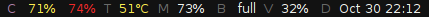

dwmstatus
=========

Conky like DWM status bar written in C.

- CPU Load / colored Frequency
- Temperature (CPU/GPU)
- Memory
- Network Profile Name
- Battery
- Volume
- Clock

---

### /tmp files

- "/tmp/volume" volume in %
- "/tmp/network-profile" if exists contains network profile name

